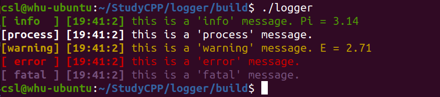

# Simple Logger With Color
>___Author___ : csl   
>___E-Mail___ : 3079625093@qq.com   

## Override
This is just a simple logger, usage is also simple.

## Usage
```cpp
    /**
     * @brief usages:
     *        Logger << messages << ... << ns_log::endl;
     */

    // for std::cout
    ns_log::info << "this is a 'info' message. Pi = " << 3.14f << ns_log::endl;
    ns_log::process << "this is a 'process' message." << ns_log::endl;
    ns_log::warning << "this is a 'warning' message. E = " << 2.71f << ns_log::endl;
    ns_log::error << "this is a 'error' message." << ns_log::endl;
    ns_log::fatal << "this is a 'fatal' message." << ns_log::endl;

    // for std::ofstream
    std::fstream file("../log.log", std::ios::out);
    ns_log::setLoggerOS(file);
    ns_log::info << "this is a 'info' message. Pi = " << 3.14f << ns_log::endl;
    ns_log::process << "this is a 'process' message." << ns_log::endl;
    ns_log::warning << "this is a 'warning' message. E = " << 2.71f << ns_log::endl;
    ns_log::error << "this is a 'error' message." << ns_log::endl;
    ns_log::fatal << "this is a 'fatal' message." << ns_log::endl;
    file.close();
```
## Display
